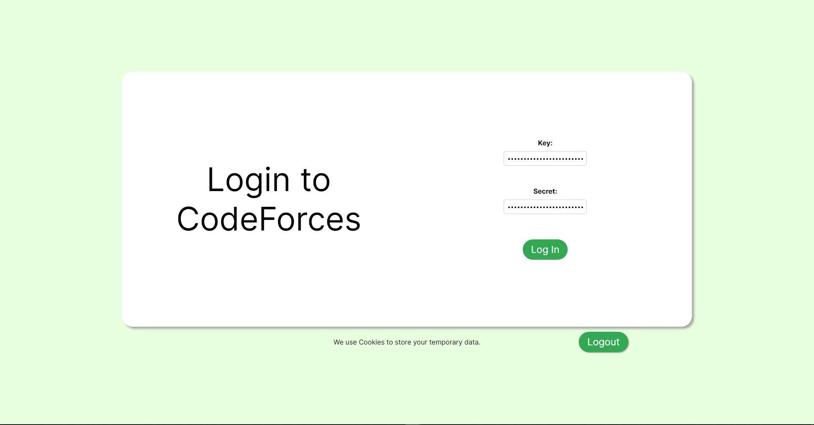
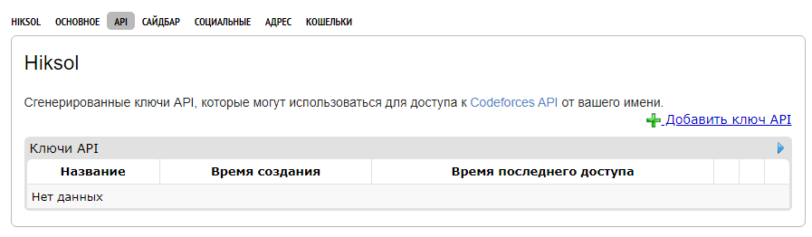
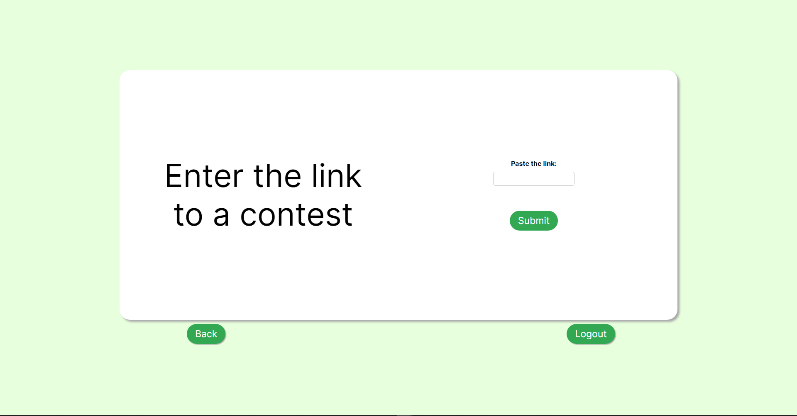
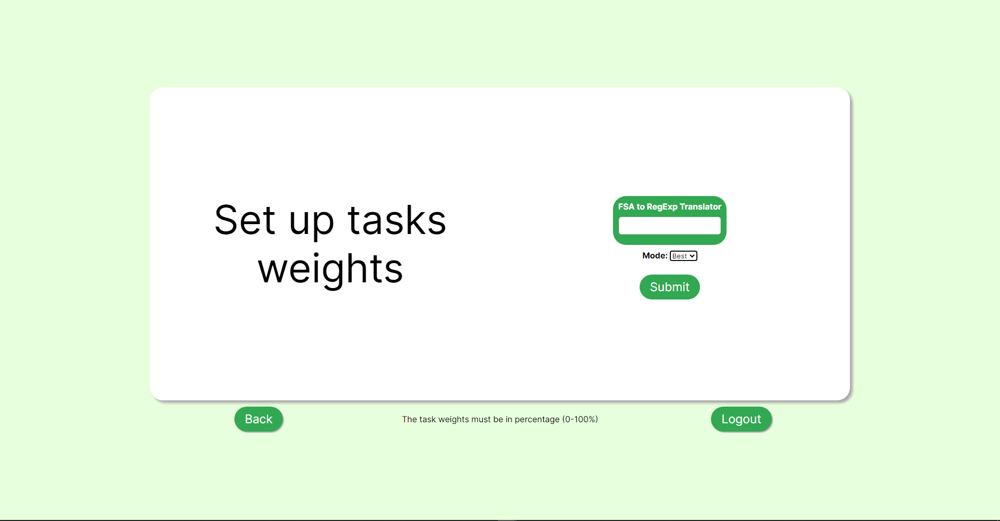
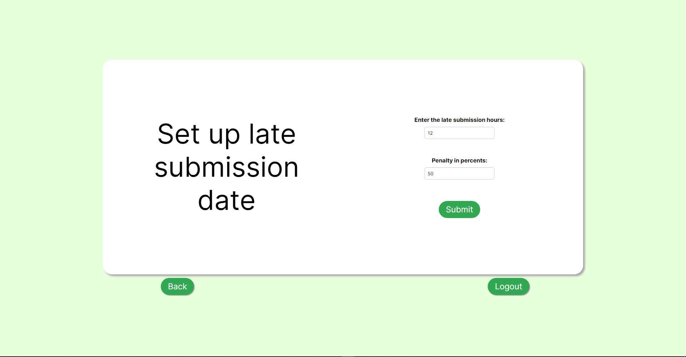
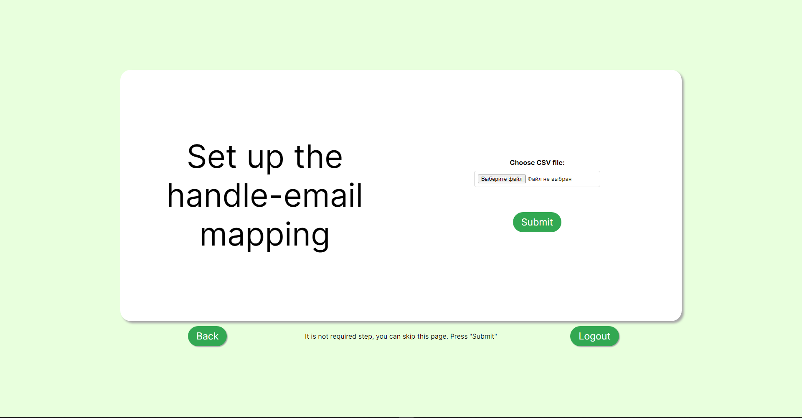
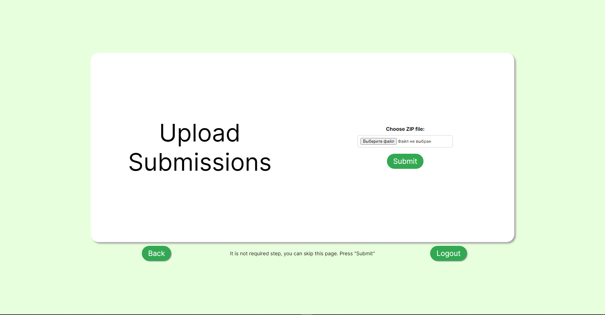
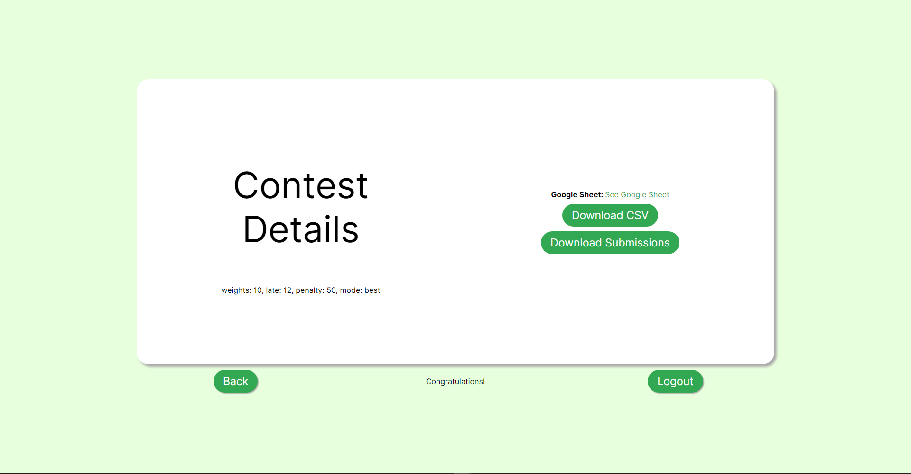

# CodeForcer

---

## License

---

MIT License

Copyright (c) 2024 Dmitiry Lukiyanov

Permission is hereby granted, free of charge, to any person obtaining a copy
of this software and associated documentation files (the "Software"), to deal
in the Software without restriction, including without limitation the rights
to use, copy, modify, merge, publish, distribute, sublicense, and/or sell
copies of the Software, and to permit persons to whom the Software is
furnished to do so, subject to the following conditions:

The above copyright notice and this permission notice shall be included in all
copies or substantial portions of the Software.

THE SOFTWARE IS PROVIDED "AS IS", WITHOUT WARRANTY OF ANY KIND, EXPRESS OR
IMPLIED, INCLUDING BUT NOT LIMITED TO THE WARRANTIES OF MERCHANTABILITY,
FITNESS FOR A PARTICULAR PURPOSE AND NONINFRINGEMENT. IN NO EVENT SHALL THE
AUTHORS OR COPYRIGHT HOLDERS BE LIABLE FOR ANY CLAIM, DAMAGES OR OTHER
LIABILITY, WHETHER IN AN ACTION OF CONTRACT, TORT OR OTHERWISE, ARISING FROM,
OUT OF OR IN CONNECTION WITH THE SOFTWARE OR THE USE OR OTHER DEALINGS IN THE
SOFTWARE.


## Table of Contents

---

- [Project Description](#project-description)
- [Feature List](#feature-list)
- [DEMO](#demo)
- [Link to the up-to-date deployed version](#link-to-the-up-to-date-deployed-version)
- [Usage Instructions / Short User Guide](#usage-instructions-short-user-guide)
- [Used Stack](#used-stack)
   - [Backend](#backend)
   - [Frontend](#frontend)
   - [Deployment](#deployment)
   - [Summary](#summary)
- [Prerequisites](#prerequisites)
   - [Installing Docker](#installing-docker)
      - [On Windows](#on-windows)
      - [On macOS](#on-macos)
      - [On Linux](#on-linux)
- [Quick Start](#quick-start)
- [Changelog](#changelog)

## Project Description

---

CodeForcer automates grading of students, it automatically generates a table with all grades convenient for uploading to moodle, allows you to flexibly customize students' grades by modifying the table, as well as download all solutions in a convenient format making it easy to check for anti-plagiarism.

## Feature List

---

- Setting task weights
- Configuration of best or latest submission
- Configuration of late submission
- Handle to email mapping
- Download all solutions in a convenient format
- Output of all grades in a convenient table

## DEMO

---

[Watch the video on Google Drive](https://drive.google.com/file/d/15c5pHOeX0On2I38BgA7xgIGPSDFpnNNT/view?usp=sharing)

## Link to the up-to-date deployed version

---

[Link](http://158.160.128.181:3000)

## Usage Instructions / Short User Guide

---

When we open the site we are immediately taken to the authorization page, where we need to enter our key and secret from the codeforces API.



If you don't know what a key and secret is, and how to get it, you just need to follow this [link](https://codeforces.com/settings/api) to the codeforces api page, and just click on the green cross button "Add API Key".



When you click on the Log in button, a page opens where you have to enter a link to the contest from which you want to get the scores.



On the next page, a list of tasks to be evaluated with points awaits us. For example, if you plan to give 20 points for this assignment, and there are 2 tasks, you can divide the points equally, i.e. the first task will give the student 10 points, and the second task will also give the student 10 points. If there is only one task, then set the weight for it to 20 points.

You can also choose whether the program will view the last or the best solution. In the first case, the program will simply take the last solution and look at its result. In the second case, the program will look for the solution with the highest score among all solutions, and if there are several of them, it will choose the last one from this list.



On the next page, you will be able to configure the late submission policy. You need to specify how many hours you can be late in submitting the solution and what percentage of penalty you will be penalized for being late.



On the next page, you are asked to attach a CSV file that contains the relationship between students' handles and their emails.



Then you are asked to attach a ZIP archive with all student solutions, the program will process this archive and give you the same, but in a more convenient format "Task (folder) → Programming language (folder) → All student solutions signed with their full name (files)". You can also download the archive on the codeforces contest page.



Finally you get the coveted page with the result of the program, here you can see the work of the program in Google Sheet, you can download CSV file or all submissions.



## Used stack

---

This project utilizes the following technologies:

### Backend

- **Go**: The backend is built using the Go programming language. We utilized the standard `net/http` package to implement the HTTP server.

### Frontend

- **React**: The frontend is developed using React, a popular JavaScript library for building user interfaces.

### Deployment

- **Docker**: A `Dockerfile` is provided to facilitate easy deployment of the application. Docker allows for consistent and reproducible environments, ensuring that the application runs smoothly across different systems.

### Summary

- **Backend Language**: Go
- **Backend Framework**: `net/http` (standard library)
- **Frontend Library**: React
- **Deployment**: Docker

## Prerequisites

---

Make sure you have Docker installed on your machine. If Docker is not installed, follow these steps:

### Installing Docker

#### On Windows:

1. Download and install Docker Desktop from [Docker Hub](https://www.docker.com/products/docker-desktop).
2. Follow the installation instructions.
3. After installation, Docker Desktop should start automatically. If not, start it manually.

#### On macOS:

1. Download and install Docker Desktop from [Docker Hub](https://www.docker.com/products/docker-desktop).
2. Follow the installation instructions.
3. After installation, Docker Desktop should start automatically. If not, start it manually.

#### On Linux:

1. Update your package database.

    ```bash
    sudo apt-get update
    ```

2. Install Docker.

    ```bash
    sudo apt-get install -y docker.io
    ```

3. Start Docker.

    ```bash
    sudo systemctl start docker
    ```

4. Enable Docker to start at boot.

    ```bash
    sudo systemctl enable docker
    ```

## Quick start

---

To start the whole application you need to build and run the docker image.
Follow these steps to quickly get the project up and running.

Clone the repository to your local machine using the following command:

```bash
git clone https://gitlab.pg.innopolis.university/n.solomennikov/choosetwooption.git
```

Move to cloned project directory and build docker image.

```bash
cd choosetwooption
docker build -t codeforcer .
docker run -d -p 8080:8080 -p 3000:3000 codeforcer
```
Now the web application runs on http://localhost:3000.

## Changelog

### MVP3
- Minor interface improvements.
- Enhanced program stability.
- Fixed a large number of bugs.
- Significant refinement of data output format in Google Sheets.

### MVP2
- Removed user login and password authorization for security purposes.
- Redesigned contest selection system, now requiring only the contest link.
- Added logout function.
- Added task weight configuration and best or latest submission mode.
- Added late submission policy configuration.
- Significant interface improvements.

### MVP1
- Added authorization via Codeforces using login, password, API key, and secret.
- Implemented contest selection system by sorting them into groups.
- Implemented test-level result output to Google Sheets.


